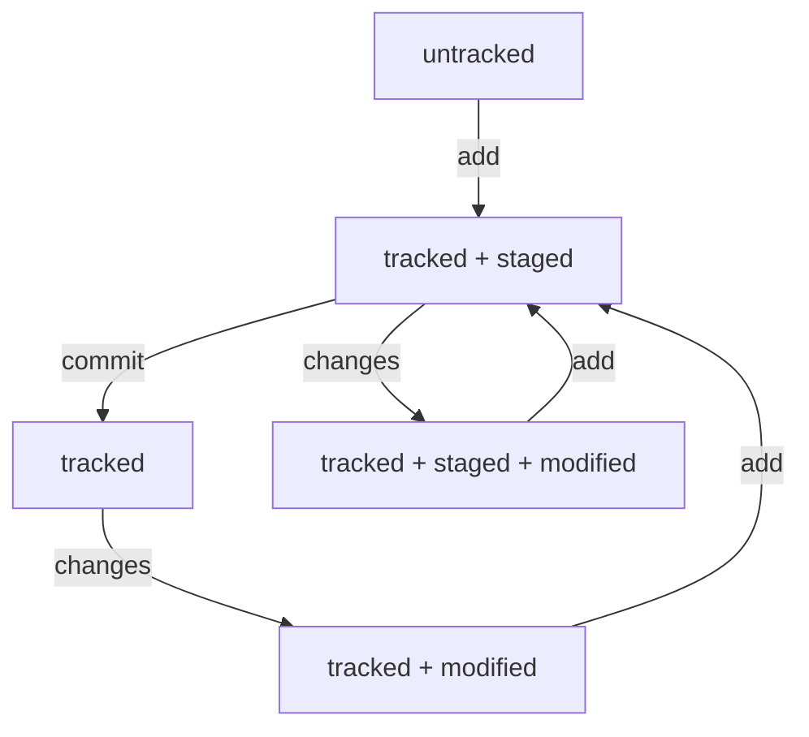

## Инструкция по работе с Git
На компьютере должен быть установлен Git. Команды выполняются в окне терминала (для Windows это Git Bash).
#### 1. Работаем на локальном компьютере
1.1 Переходим в домашнюю директорию, создаем директорию проекта, например **project** и сразу переходим в эту директорию:
```
$ cd ~
$ mkdir project && cd project
```
1.2 Создаем файл проекта, например **text.txt** и добавляем в него строку "Some text information":
```
$ touch text.txt
$ echo "Some text information" > text.txt
```
1.3 Создаем репозиторий Git в текущей директории project
```
$ git init
```
1.4 Добавляем **text.txt** в список для сохранения текущего состояния файлов проекта:
```
$ git add text.txt
```
1.5 Делаем коммит, то есть сохраняем текущее состояние всех файлов, добавленных перед этим в список и оставляем комментарий "Add file text.txt"
```
$ git commit -m "Add file text.txt"
```
1.6 Далее работаем по циклу:
* Изменили файлы проекта (добавили, удалили информацию из файла, добавили файл, удалили файл)
* Добавили файлы проекта в список для сохранения изменений:<br>
**git add <filename.ext>** (все сразу: **git add .**)
* Сделали коммит всех файлов, добавленных в список для сохранения:<br>
**git commit -m "Comments"**
#### 2. Log, Hash, Head
2.1 Чтобы увидель все коммиты по текущему проекту, используется команда:
```
$ git log // полная информация по коммитам
$ git log --oneline // одна строка на описание каждого коммита
```
2.2 Полное описание коммита:
```
commit bfcba5af55c74fc2f40a01703db2deff8a30f0b8 // Хеш (hash) коммита
Author: svbabaya <babayan.serge@gmail.com> // Имя пользователя и email
Date: Thu Jan 11 22:07:52 2024 +0300 // Дата создания коммита

    first commit // Комментарий, который добавляется при создании коммита
```
2.2 Однострочное описание коммита:
```
bfcba5a first commit // Только часть хеша и комментарий
```
2.3 Хеш, точнее, отпечаток (fingerprint), полученный с помощью хеш-функции - это уникальный идентификатор коммита в проекте, вычисляется на основе данных коммита (имя, email, время создания, комментарий), всегда содержит постоянное количество символов (в данном случае используется алгоритм, который создает хеш из 40 символов 0-9, a-f). Использование хеш-функции гарантирует, что отпечаток одного коммита никогда не совпадет с отпечатком другого. Git использует хеш (отпечаток) для выполнения операций с отдельными коммитами.<br>
2.4 HEAD (указатель) в сообщениях git обозначает текущую ветку проекта и последний коммит на этой ветке:
```
commit 4e2037f590e053de21392e89cdeeeab204d84f71 (HEAD -> master) // текущая ветка master
...
```
Это хеш (отпечаток) последнего коммита на ветке **master**. Дальнейшие изменения файлов, находящихся в этом коммите, git отслеживает относительно этого состояния (файл переходит в состояние **modified**). В папке **.git** есть файл **HEAD**, в котором хранится ссылка на файл, соответствующий названию текущей ветки:
```
$ cat HEAD
ref: refs/heads/master``` // ссылка на файл master, при изменении текущей ветки ссылка меняется
```
В этом файле хранится хеш (отпечаток) последнего коммита:
```
$ cat refs/heads/master
4e2037f590e053de21392e89cdeeeab204d84f71 // после каждого коммита меняется
```
#### 3. Сообщения в коммите
3.1 Существует три общепринятых подхода к написанию сообщений при создании коммита: Corporate style, Convention style, Git style
3.2 Corporate style означает использование кода проекта и номера задачи (заявки) в начале сообщения, например:
```
$ git commit -m "BMW-320: ..."
```
3.3 Convention style означает использование в начале сообщения зарании определенных ключевых слов, обозначающих различные виды изменений (fix, feat, style, refactor и т.д.):
```
$ git commit -m "fix: ..."
```
3.4 Git style подразумевает добавление в текст каждого сообщения ссылки на номер задачи из GitHub, если вы используете систему управления проектами в GitHub. Для обозначения ссылки используется **#**:
```
$ git commit -m "... #334..."
```
3.6 Общие правила, которого принято придерживаться во всех стилях:
* Длина текста не превышает 72 символа (чтобы сообщение полностью отображалось при однострочном выводе списка коммитов)
* Использование инфинитивов (отвечаем на вопрос: Что нужно было сделать в этом коммите?)
#### 4. Статусы файлов
4.1 В Git cуществует 4 статуса файлов: **untracked, tracked, staged, modified**.<br> 
4.2 Схема изменения статусов:



4.3 Состояние **untracked** появляется у всех файлов папки проекта сразу после создания репозитория командой **init**. А после первого добавления файла в **staging area** командой **add**, файл переходит в состояние **tracked** и остается в нем на всех последующих этапах сохранения состояния проекта. При этом к состоянию **tracked** в зависимости от ситуации добавляются состояния **staged**, **modified**. Вернуть файл в состояние **untracked** можно только с помощью специальной команды.
#### 5. Исправление ошибок, откат изменений
5.1 Чтобы внести изменения в последний коммит, используется ключ **--amemnd**, измененные файлы должны быть предварительно добавлены в **staging area** командой **git add**:
```
$ git commit --amend --no-edit // изменится только коммит, сообщение останется прежним
$ git commit --amend -m "new message" // изменится только сообщение последнего коммита
S git commit --amend // если указать только --amend, git откроет сообщение последнего коммита в текстовом редакторе, установленном по умолчанию
```
5.2 Чтобы отменить изменения в файле, сделанные после коммита, но до размещения файла в staged area, используется команда **restore**:
```
$ git restore <file> // статус modified будет снят, изменения в файле будут удалены
```
5.3 Чтобы исключить файл из **staging area** и вернуть его в предыдущее состояние (untracked или tracked + modified), используется команда **restore --staged**:
```
$ git restore --staged <file>
$ git restore --staged . // исключает из staging area все файлы
```
5.4 Чтобы откатиться к любому предыдущему коммиту, используется команда **reset**, при этом более поздние коммиты потеряются:
```
$ git reset --hard <commit> // commit - уникальный идентификатор коммита, то есть отпечаток (хеш), который можно получить командой **git log** или **git log --oneline** (в этом случае копируем начальные символы отпечатка)
```
#### 6. Просмотр изменений и сравнение
6.1 Чтобы увидеть увидеть, какие изменения произошли в файле проекта, используется команда **diff**:
```
$ git diff // работает только для файлов, которые еще не были загружены в staging area и отобразит строки, которые были удалены (отмечаются красным цветом и знаком минус) и добавлены (отмечаются зеленым цветом и знаком плюс)
$ git diff --staged // работает для файлов, загруженных в staging area, то есть в состоянии tracked + staging
```
6.2 Чтобы сравнить состояние файлов в разных коммитах, необходимо использовать отпечатки (хеши) коммитов, получаемые командами git log, git log --online (более предпочтительный вариант):
```
$ git diff a67a088 4de0fb8 // указываем последовательно два хеша, вместо хеша последнего коммита можно использовать слово HEAD, при этом порядок хешей влияет только на порядок отображения изменений
```
#### 7. Игнорирование файлов
7.1 Создаем в папке проекта скрытый текстовый файл **.gitignore**, в этом файле указываем названия тех файлов, которые не нужно коммитить. Файлы проекта, оказавшиеся в .gitignore, не отображаются как untracked по команде git status. Зато отображается .gitignore в статусе untracked и его нужно будет добавить в staging area и закоммитить.<br>
7.2 Правила .gitignore распространяются только на файлы со статусом untracked, то есть те, которые еще не попали в staging area и в commit, поэтому создать список в .gitignore лучше перед первой индексацией файлов.<br>
7.3 Для создания списка игнорируемых файлов используются шаблоны:
```
# // обозначает комментарий
* // любая строка, включая пустую, например *.jpeg
docs/*/tmp // игнорировать все файлы tmp во всех подпапках docs
? // один любой символ, например file?.txt - будет проигнорирован любой файл с именем file1.txt, file2.txt и т.п. не более, чем из 5-ти символов, файл file12.txt проигнорирован не будет.
[...] // один символ из указанного в скобках списка, например file[0-2].txt, file[ABC].txt
/ // указание на каталоги, например /text.txt - игнорировать файл только в корневой папке репозитория, docs/ - игнорировать весь каталог docs
** // любое количество вложенных папкок, в том числе 0, например docs/**/tmp - игнорировать файлы tmp в папках docs/current/, docs/1/, docs/current/1/2/ и т.п., при этом docs/*/tmp распространяется только на один уровень подпапок
! // инвертирование запрета, например !help.txt - разрешение добавлять файл в stage area и коммитить
```
7.4 Чтобы отобразить игнорируемые файлы используется ключ --ignored:
```
$ git status --ignored
```
#### 8. Клонирование репозитория с GitHub
8.1 Создать папку, в которой будет храниться клонированный репозиторий. На GitHub скопировать ссылку на репозиторий (HTTPS или SSH, если настроен ssh-key). Зайти в папку для репозитория и выполнить команду:
```
$ git clone git@github.com:svbabaya/PracticalWork.git
```
Команда **git clone** автоматически связывает локальный репозиторий с удаленным.
8.2 Чтобы убедиться, что репозитории связаны, выполните команду:
```
$ git remote -v
```
#### 9. Fork
9.1 Fork - это полная копия репозитория на GitHub и не имеет отношения к функциональности Git.
9.2 В репозиторий, полученный в результате выполнения операции **fork**, можно вносить любые изменения, копия полностью независима от оригинала.
9.3 Обычно для работы с каким-то публичным проектом, размещенным на GitHub, сначала делают **fork**, а затем клонируют полученный репозиторий на локальный компьютер с помощью **git clone**.
9.4 Чтобы синхронизировать репозиторий, полученный в результате операции **fork** и оригинальный репозиторий, применяются инструменты GitHub (операция sync fork).
9.5 В репозиториях формата  **awesome lists** собраны полезные ссылки.
### 10. Branches
10.1 git branch
10.2 git branch <name_branch>, feature/, bugfix/
10.3 git checkout <name_branch>
10.4 git checkout -b <name_branch> = git branch <name_branch> + git checkout <name_branch>
10.5 Ветка - указатель на коммит, который сделан в ней последним. При создании нового коммита, указатель передвигается вперед. Сразу после создания (пока еще не сделан ни один коммит), новая ветка указывает на тот же коммит, что и основная (из которой она была создана).
10.6 git chechout <name_branch> создает локальные версии веток из origin-версий после клонирования с GitHub.
10.7 git diff <name_branch_1> <name_branch_2> - Git находит два коммита, на которые указывают ветки, поэтому вместо названий веток можно использовать хеши коммитов и HEAD.
10.8 Суффикс навигации **~N** используется для упрощенного обохначения коммитов. Последний коммит **HEAD~0** - это то же, что и **HEAD**, предпоследний **HEAD~1** и т.п. Вместо **HEAD~1** можно написать **HEAD~**. Символ **~** можно добавлять к названиям веток и хешам.
```
$ git diff HEAD~ HEAD // сравнить предпоследний и текущий коммит
```
### 11. Объединение и удаление веток
11.1 git merge <name_branch> // при этом нужно находиться на той ветке, с которой нужно слить ветку, указанную в параметрах, то есть ветку name_branch нужно влить в текущую.
11.2 После слияния образуется общий коммит, на который указывают две ветки. Например, если мы на ходимся на ветке **master** и хотим сделать слияние с веткой **feature**, на которой сделан коммит, нужно выполнить команду **git merge feature**, при этом коммит, на который раньше ссылалась только ветка **feature**, станет коммитом на ветке **master**, то есть на этот коммит будет ссылаться также и ветка **master**. Это можно увидеть при выполнении команды **git log**: (HEAD -> master, feature). Если же перейти в ветку **feature** и открыть коммиты, то мы увидим тот же коммит (хеш) и (HEAD -> feature, master).
11.3 git branch -D <branch_name> // удалит ветку в любом случае
11.4 git branch -d <branch_name> // удалит ветку только если она была слита с другой
11.5 Удаление локальной ветки в Git не удаляет эту ветку на GitHub.
### 12. Работа с ветками в удаленном репозитории
12.1 git push // отправить локальную ветку в удаленный репозиторий
12.2 git remote add origin <repository_link> // так можно привязать локальный проект (в котором уже создан репозиторий) к удаленному репозиторию (должен быть предварительно создан на GitHub). Выполнять эту команду нужно находясь в том репозитории, который связывается с удаленным. Далее нужно убедиться, что находимся на главной ветке (main, master). И затем нужно связать локальную ветку с удаленной: **git push -u origin master**. Origin - имя (псевдоним) удаленного репозитория.
12.3 Если необходимо, чтобы новая ветка в локальном репозитории получила свою копию на удаленном, нужно для нее применить команду **git push -u origin <name_branch>**, после чего на GitHub появится копия этой ветки, содержимое будет синхронизировано.
### 13. Запрос на изменения (pull request, pr) на GitHub
13.1 При работе в команде, каждый участник работает в своей ветке. Когда нужно отправить свой код в проект (это может быть основная ветка), пользователь создает pull request (запрос на рассмотрение предлагаемых изменений) на GitHub. Коллеги проверяют код, делают code review и затем, после финального согласования, разрешается merge нового кода в основную ветку.
13.2 Каждый PR состоит из 4-х блоков: название, описание, исходная ветка, целевая ветка.
13.3 У PR может быть два исхода: merge (происходит слияние, pr закрывается) и close (pr закрывается без слияния).
13.4 Обычно помимо основной ветки main (master), в репозитории создается ветка dev (development). В main хранится основная рабочая версия, а dev используется для активной работы, слияния с ветками отдельных разработчиков, в том числе для обработки PR. Время от времени изменения из dev сливаются в main.
13.5 PR можно создать только для ветки, у которой есть новые изменения.
### 14. Как забрать изменения с GitHub
14.1 Переходим в директорию проекта, убеждаемся, что находимся на нужной ветке (обычно main, master) и выполняем команду:
```
$ git pull
```
14.2 Обычно это первая команда, которую нужно выполнить, прежде чем работать над проектом - то есть получить все последние изменения с GitHub.
14.3 Хорошая практика - перед созданием pull request подтянуть последние изменения с GitHub на главную ветку локального репозитория, затем слить эти изменения в свою ветку (лучше, чтобы это была какая-то отдельная ветка, не основная), решить конфликты при необходимости, затем отправить эту ветку на GitHub и только потом делать pull request:  
```
$ git checkout main # перешли в main
$ git pull # подтянули новые изменения в main
$ git checkout my-branch # вернулись в рабочую ветку my-branch
$ git merge main # влили main в новую ветку my-branch
$ git push -u origin my-branch # отправили ветку my-branch в удалённый репозиторий
```
После этого можно делать pull request на GitHub.
### 15. Замена origin
15.1 Может понадобиться, если есть локальный проект, связанный с каким-то удаленным репозиторием и нужно убрать эту связь, сделать форк удаленного репозитория и привязать локальный к нему:
```
$ git remote rm origin # отвязать локальный репозиторий от удаленного
$ git remote add origin <repository_link> # привязать к удаленному репозиторию
```
### 16. Основные операции
16.1 Клонирование репозитория
```
$ git clone <repository_link> # создает локальную папку, копирует репозиторий в локальную папку, связывает локальный и удаленный репозиторий, связывает основные ветки локального и удаленного репозитория.
```
16.2 Создание веток
```
$ git branch <branch_name> # создает ветку, которая ссылвется на последний (HEAD) коммит текущей ветки.
$ git checkout -b <branch_name> # создает ветку и сразу переключается на нее.
```
16.3 Навигация по веткам
```
$ git branch # список локальных веток с указанием текущей (*)
$ git branch -a # список всех веток: локальных и удаленных, которые еще не привязаны к локальному репозиторию (отмечаются цветом и префиксом remote/origin)
$ git checkout <branch_name> # переключение на ветку локального репозитория и связывание ветки удаленного репозитория (remote/origin/branch_name) c локальным и переключение на эту ветку (теперь ветка будет отображаться в списке как branch_name)
```
16.4 Сравнение веток
```
$ git diff <branch_name_1> <branch_name_2> # разница между последними коммитами веток 
$ git diff master HEAD # разница между последним коммитом ветки master и веткой, на которую указывает HEAD
$ git diff HEAD~2 HEAD # разница между коммитами текущей ветки: тем, который отстоит на 2 шага от последнего и последним
```
16.4 Удаление веток
```
$ git branch -D <branch_name> # удаление ветки без всяких условий, даже если она не объединена (угроза потери изменений)
$ git branch -d <branch_name> # удаление ветки только в том случае, если было сделано ее слияние с основной
```
16.5 Слияние веток
```
$ git merge <branch_name> # Последний коммит branch_name становится коммитом текущей ветки, то есть на него ссылается разу две ветки: в которой он был изначально создан и та, в которую от был слит (текущая ветка)
```
16.6 Работа с удаленным репозиторием
```
$ git remote add origin <repository_link> # привязать локальный репозиторий к удаленному (предварительно создан на GitHub)
$ git remote rm origin # разорвать связь локального репозитория с удаленным
$ git push -u origin branch_name # отправить новую ветку в удаленный репозиторий и связать локальную ветку с удаленной (делается один раз), после чего синхронизация веток выполняется командой **git push**
$ git push <branch_name> # отправить изменения в ветку, которая уже существует в удаленном репозитории
$ git pull # подтянуть изменения текущей ветки из удаленного репозитория
```
### 17. Работа с ветками. Fast-forward
17.1 Состояние **fast-forward** это когда одна ветка является продолжением другой и ветки могут быть слиты без конфликтов. При слиянии происходит как бы «перемотка» (fast-forward) основной ветки (в которую сливают коммиты) на несколько коммитов вперед (те коммиты, которые приходят из другой ветки). При этом при выполнении команды **git merge** сообщается, что имеет мето именно fast-forward. Если истории двух веток не «разошлись» и их коммиты выстраиваются в одну цепочку, эти ветки можно объединить в режиме fast-forward.
17.2 Режим fast-forward можно отключить в текущем слиянии:
```
$ git merge --no-ff <branch_name>
```
Либо можно отключитьдля всех слияний:
```
$ git config [--global] merge.ff false
```
При отключении ff будет создан только один коммит слияния (merge commit). При этом обычно отключают ввод ссобщения:
```
$ git merge --no-edit --no-ff <branch_name>
```
Можно отобразить создание merge commit при слиянии с помощью флага --graph:
```
$ git log --graph --oneline
```
17.3 Отключение ff используется для того, чтобы сохранялась информация, с какой веткой и в каком месте произошло слияние. В режиме ff в списке коммитов просто появляются новые коммиты, без указания ветки.
### 18. Работа с ветками. Non-fast-forward
18.1 Истории двух веток разошлись и теперь их нельзя выстроить в одну линию. Эту ситуацию можно отобразить с помощью команды log, если указать в качестве параметров две ветки:
```
$ git log --graph --oneline main <branch_name>
```
18.2 Теперь просто так «положить» одну ветку в другую может не получиться, возможен конфликт.
18.3 При слиянии таких веток автоматически создается merge commit:
```
$ git merge --no-edit <name_branch> # для merge commit можно отключить запрос сообщения
```
18.4 Информация о слиянии отображается так же, как при создании merge commit в режиме fast-forward:
```
$ git log --graph --oneline
```
18.5 Если есть конфликт, Git предложить разрешить его вручную.
### 19. Работа с ветками удаленного репозитория
19.1 Локальные ветки и их удаленные аналоги могут находится в состоянии fast-forward и non-fast-forward.
19.2 В состоянии fast-forward по команде push коммиты локальной ветки без проблем вливаются в удаленную ветку.
19.3 Если у удаленной ветке появился коммит, которого нет в локальной, это уже состояние non-fast-forward и при попытке применить команду push будет выведена сообщение, что запрос отклонен ![rejected] и error: faild to push some refs to <repo_link>. Еще в таком сообщении будет подсказка: Integrate the remote changes (e.g. 'git pull ...') before publishing again.
19.4 Проблему разошедшихся в локальном и удаленном репозитории веток можно решить командой rebase, которая меняет точку, от которой отделилась ветка. После rebase ветки переходят в состояние fast-forward и сливаются командой push.
19.5 В процессе rebase могут возникнуть конфликты, поскольку лишний коммит на удаленной ветке должен быть перенесен на локальную.
19.6 Решить проблему слияния удаленной и локальной веток, которые находятся в режиме non-fast-forward можно командой:
```
$ git push --force
```
При этом лишний коммит на удаленной ветке удаляется, что переводит систему в состояние fast-forward и происходит слияние. Это опасный способ, который может привести к потере значимой информации. Применяется в случае, если кто-то сломал удаленную ветку, тогда берется локальная копия репозитория, в котором ветка не сломана и из нее восстанавливается ветка в origin. 
### 20. Применение push в командной работе, проблема с общей веткой main
20.1 Если на проектом работает несколько человек и они делают push своих веток прямо в main, добиться состояния веток fast-forward сложно. Локальная и удаленная ветка будут постоянно «расходиться».
20.2 Для решения проблемы «расходящихся» веток можно использовать rebase, но для большой команды это неудобно.
20.3 В большинстве систем управления версиями есть настройка, запрещающая делать push прямо в main.
20.4 В командных проектах перед попаданием изменений в главную ветку есть промежуточный шаг: согласование (обычно это pull request и code review).
### 21. Подходы к работе с ветками
21.1 Эти подходы (стратегии, workflow) используются в ситуации, когда код проекта хранится в GitHub.
21.2 Feature (особенность) branch workflow - для каждого нового изменения создается новая ветка, которая потом вливается в main с помощью git merge. Обычно под задачу создается ветка типа feature/add-something и после выполнения ветка вливается в main. У каждой ветки есть свой разработчик. В ветке main всегда рабочая версия проекта. Все коммиты в main - это коммиты слияния. Разработчикам запрещено делать push со своей ветки. Сначала нужно сделать merge в main локально, только после этого в определенный момент происходит push локальной ветки main на GitHub. Такой подход исключает необходимость делать постоянный rebase локальной ветки main (???)
21.3 Git flow - создается больше веток, а коммиты делятся на разные типы (исправление, новая функциональность...). Разные типы коммитов в разных ветках.
21.4 Trunk-based - участники проекта вливают свой код в main максимально часто.
### 22. Pull request и code review
22.1 Pull Request (PR) и Merge Request (MR) - это одно и то же в разных VCS.
22.2 На этапе Code Review может быть проверка кода на работоспособность, уязвимость, запуск тестов, вопросы по коду, предложения по улучшению, проверка соответствия стиля программирования принятым стандартам.
22.3 Если ревьюера все устраивает, от нажимает **Approve**. Иногда используется комментарий **LGTM** (Looks Good To Me).
22.4 После одобрения PR можно нажать кнопку **Merge**, ветка будет влита main после чего GitHub предложит удалить ненужную ветку.
### 23. Пример процесса
23.1 Нового разработчика добавляют в участники репозитория (collaborator). Если не добавляют, то новый разработчик делает fork проекта.
23.2 Новый разработчик клонирует проект (главную ветку) на свой компьютер.
23.3 Создает новыю ветку для решения какой-то задачи и переключается на неё, например, feature-add-something
23.4 Вносит изменения в проект, добавляет файлы в staging area и делает commit.
23.5 Загружает изменения в удаленный репозиторий, при этом на GitHub создается такая же ветка, как на локальном компьютере:
```
$ git push --set-upstream origin HEAD # если текущая ветка feature-add-something
$ git push --set-upstream origin feature-add-something
$ git push -u origin HEAD # если текущая ветка feature-add-something
$ git push -u origin feature-add-something
```
Флаг для связи локальной и удаленной ветки **--set-upstream--** это полное написание флага **-u**.
23.6 При первой для ветки команде push отобразится ссылка, по которой откроется страница создания pull request. Зайти на эту страницу можно также через меню GitHub.
23.7 На странице создания pull request при необходимости выбираем какая ветка должна вливаться в main (связка base - compare), указываем название pull request, комментарий и нажимаем кнопку **Create pull request**.
23.8 После этого может появится информация о настройках pull request, например **Review required**, **Merging is blocked**.
23.9 Ревьюер видит pull request, открывает файл, смотрит что добавлено/удалено, выделяет спорные строки, добавляет комментарии, нажимает **Start review** и выносит вердикт, **Comment** (просто комментарий без одобрения и отмены), **Approve** (одобрение) или **Request changes** (запрос изменений).
23.10 Автор pull request видит ответ ревьюера, в локальном репозитории вносит исправления, делает один или несколько коммитов (по ситуации) и выполняет команду:
```
git push # этого достаточно, поскольку связывание текущей ветки с удаленным репозиторием было сделано на предыдущем шаге, при первой синхронизации
```
23.11 Автор pull request открывает закладку Conversation на странице pull request и оставляет комментарий об исправлении + хеш коммита (хеши коммитов). Хеш коммита можно скопировать на закладке Commits.
23.12 Ревьюер смотрит комментарий разработчика и если все устраивает выносит вердикт **Approved**.
23.13 После одобрения у автора pull request и ревьюера появится кнопка **Merge pull request**, поскольку они оба участники проекта, то есть коллаборанты.
23.14 Автор pull request нажимает **Merge pull request** и **Confirm merge**, после чего произойдет вливание ветки feature-add-something в main.
23.15 После слияния GitHub предложит удалить ненужную ветку feature-add-something, на это желательно согласиться. 
23.16 Теперь локальная main отстает от удаленной, поэтому сразу необходимо синхронизировать эти ветки:
```
$ git checkout main && git pull
```
23.17 В проектах open-source сторонний участник обычно не является коллаборантом, поэтому ему сначала нужно сделать fork, потом склонировать его себе. А кнопка **Merge pull request** у такого участника не появится, она доступна только коллаборантам.
### 24. Работа с PR: soft skills
24.1 Ревьюер: Помочь в улучшении кода, а не унижать.
24.2 Автор pull request: Сделать код, собщения коммитов, описание pull request максимально понятным. Код должен проходить автотесты. Постараться разобраться почему и зачем ревьюер предлагает доработать код - задавать вопросы.
### 25. Разрешение конфликта вручную и через vimdiff
25.1