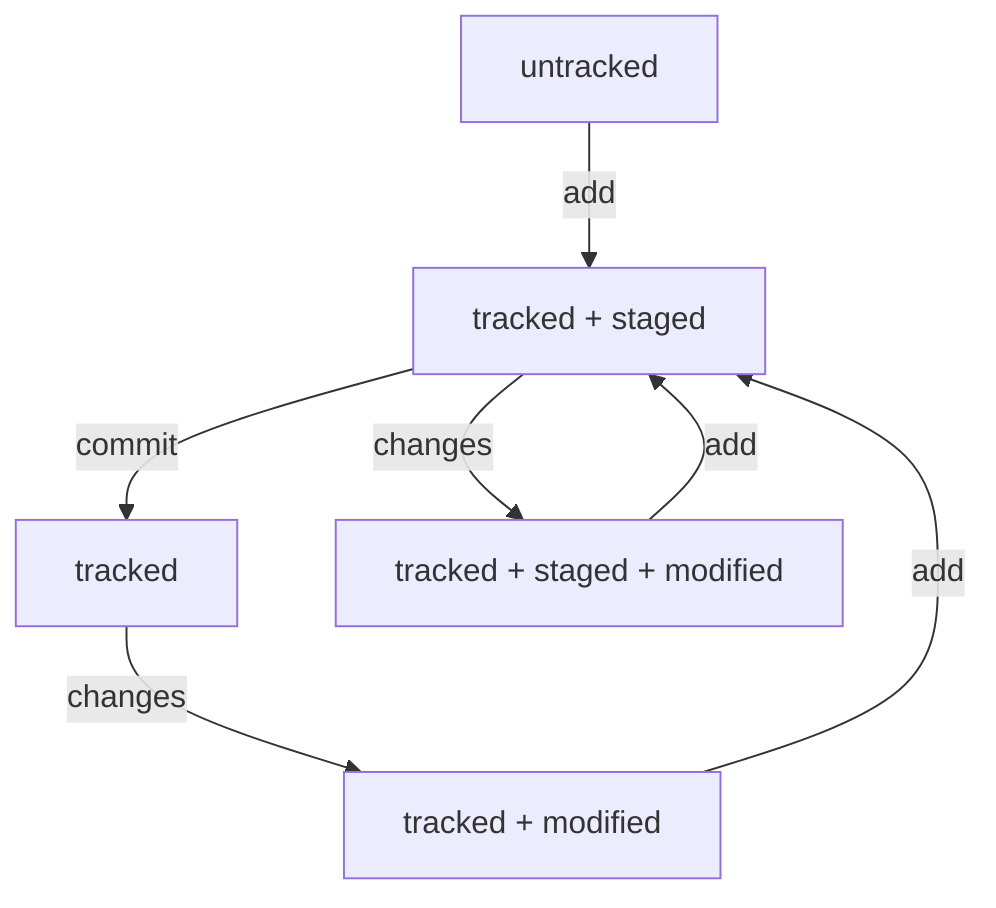

## Инструкция по работе с Git
На компьютере должен быть установлен Git. Команды выполняются в окне терминала (для Windows это Git Bash).
#### 1. Работаем на локальном компьютере
1.1 Переходим в домашнюю директорию, создаем директорию проекта, например **project** и сразу переходим в эту директорию:
```
$ cd ~
$ mkdir project && cd project
```
1.2 Создаем файл проекта, например **text.txt** и добавляем в него строку "Some text information":
```
$ touch text.txt
$ echo "Some text information" > text.txt
```
1.3 Создаем репозиторий Git в текущей директории project
```
$ git init
```
1.4 Добавляем **text.txt** в список для сохранения текущего состояния файлов проекта:
```
$ git add text.txt
```
1.5 Делаем коммит, то есть сохраняем текущее состояние всех файлов, добавленных перед этим в список и оставляем комментарий "Add file text.txt"
```
$ git commit -m "Add file text.txt"
```
1.6 Далее работаем по циклу:
* Изменили файлы проекта (добавили, удалили информацию из файла, добавили файл, удалили файл)
* Добавили файлы проекта в список для сохранения изменений:<br>
**git add <filename.ext>** (все сразу: **git add .**)
* Сделали коммит всех файлов, добавленных в список для сохранения:<br>
**git commit -m "Comments"**
#### 2. Log, Hash, Head
2.1 Чтобы увидель все коммиты по текущему проекту, используется команда:
```
$ git log // полная информация по коммитам
$ git log --oneline // одна строка на описание каждого коммита
```
2.2 Полное описание коммита:
```
commit bfcba5af55c74fc2f40a01703db2deff8a30f0b8 // Хеш (hash) коммита
Author: svbabaya <babayan.serge@gmail.com> // Имя пользователя и email
Date: Thu Jan 11 22:07:52 2024 +0300 // Дата создания коммита

    first commit // Комментарий, который добавляется при создании коммита
```
2.2 Однострочное описание коммита:
```
bfcba5a first commit // Только часть хеша и комментарий
```
2.3 Хеш, точнее, отпечаток (fingerprint), полученный с помощью хеш-функции - это уникальный идентификатор коммита в проекте, вычисляется на основе данных коммита (имя, email, время создания, комментарий), всегда содержит постоянное количество символов (в данном случае используется алгоритм, который создает хеш из 40 символов 0-9, a-f). Использование хеш-функции гарантирует, что отпечаток одного коммита никогда не совпадет с отпечатком другого. Git использует хеш (отпечаток) для выполнения операций с отдельными коммитами.<br>
2.4 HEAD (указатель) в сообщениях git обозначает текущую ветку проекта и последний коммит на этой ветке:
```
commit 4e2037f590e053de21392e89cdeeeab204d84f71 (HEAD -> master) // текущая ветка master
...
```
Это хеш (отпечаток) последнего коммита на ветке **master**. Дальнейшие изменения файлов, находящихся в этом коммите, git отслеживает относительно этого состояния (файл переходит в состояние **modified**). В папке **.git** есть файл **HEAD**, в котором хранится ссылка на файл, соответствующий названию текущей ветки:
```
$ cat HEAD
ref: refs/heads/master``` // ссылка на файл master, при изменении текущей ветки ссылка меняется
```
В этом файле хранится хеш (отпечаток) последнего коммита:
```
$ cat refs/heads/master
4e2037f590e053de21392e89cdeeeab204d84f71 // после каждого коммита меняется
```
#### 3. Сообщения в коммите
3.1 Существует три общепринятых подхода к написанию сообщений при создании коммита: Corporate style, Convention style, Git style
3.2 Corporate style означает использование кода проекта и номера задачи (заявки) в начале сообщения, например:
```
$ git commit -m "BMW-320: ..."
```
3.3 Convention style означает использование в начале сообщения зарании определенных ключевых слов, обозначающих различные виды изменений (fix, feat, style, refactor и т.д.):
```
$ git commit -m "fix: ..."
```
3.4 Git style подразумевает добавление в текст каждого сообщения ссылки на номер задачи из GitHub, если вы используете систему управления проектами в GitHub. Для обозначения ссылки используется **#**:
```
$ git commit -m "... #334..."
```
3.6 Общие правила, которого принято придерживаться во всех стилях:
* Длина текста не превышает 72 символа (чтобы сообщение полностью отображалось при однострочном выводе списка коммитов)
* Использование инфинитивов (отвечаем на вопрос: Что нужно было сделать в этом коммите?)
#### 4. Статусы файлов
4.1 В Git cуществует 4 статуса файлов: **untracked, tracked, staged, modified**.<br> 
4.2 Схема изменения статусов:



4.3 Состояние **untracked** появляется у всех файлов папки проекта сразу после создания репозитория командой **init**. А после первого добавления файла в **staging area** командой **add**, файл переходит в состояние **tracked** и остается в нем на всех последующих этапах сохранения состояния проекта. При этом к состоянию **tracked** в зависимости от ситуации добавляются состояния **staged**, **modified**. Вернуть файл в состояние **untracked** можно только с помощью специальной команды.
#### 5. Исправление ошибок, откат изменений
5.1 Чтобы внести изменения в последний коммит, используется ключ **--amemnd**, измененные файлы должны быть предварительно добавлены в **staging area** командой **git add**:
```
$ git commit --amend --no-edit // изменится только коммит, сообщение останется прежним
$ git commit --amend -m "new message" // изменится только сообщение последнего коммита
S git commit --amend // если указать только --amend, git откроет сообщение последнего коммита в текстовом редакторе, установленном по умолчанию
```
5.2 Чтобы отменить изменения в файле, сделанные после коммита, но до размещения файла в staged area, используется команда **restore**:
```
$ git restore <file> // статус modified будет снят, изменения в файле будут удалены
```
5.3 Чтобы исключить файл из **staging area** и вернуть его в предыдущее состояние (untracked или tracked + modified), используется команда **restore --staged**:
```
$ git restore --staged <file>
$ git restore --staged . // исключает из staging area все файлы
```
5.4 Чтобы откатиться к любому предыдущему коммиту, используется команда **reset**, при этом более поздние коммиты потеряются:
```
$ git reset --hard <commit> // commit - уникальный идентификатор коммита, то есть отпечаток (хеш), который можно получить командой **git log** или **git log --oneline** (в этом случае копируем начальные символы отпечатка)
```
#### 6. Просмотр изменений и сравнение
6.1 Чтобы увидеть увидеть, какие изменения произошли в файле проекта, используется команда **diff**:
```
$ git diff // работает только для файлов, которые еще не были загружены в staging area и отобразит строки, которые были удалены (отмечаются красным цветом и знаком минус) и добавлены (отмечаются зеленым цветом и знаком плюс)
$ git diff --staged // работает для файлов, загруженных в staging area, то есть в состоянии tracked + staging
```
6.2 Чтобы сравнить состояние файлов в разных коммитах, необходимо использовать отпечатки (хеши) коммитов, получаемые командами git log, git log --online (более предпочтительный вариант):
```
$ git diff a67a088 4de0fb8 // указываем последовательно два хеша, вместо хеша последнего коммита можно использовать слово HEAD, при этом порядок хешей влияет только на порядок отображения изменений
```
#### 7. Игнорирование файлов
7.1 Создаем в папке проекта скрытый текстовый файл **.gitignore**, в этом файле указываем названия тех файлов, которые не нужно коммитить. Файлы проекта, оказавшиеся в .gitignore, не отображаются как untracked по команде git status. Зато отображается .gitignore в статусе untracked и его нужно будет добавить в staging area и закоммитить.<br>
7.2 Правила .gitignore распространяются только на файлы со статусом untracked, то есть те, которые еще не попали в staging area и в commit, поэтому создать список в .gitignore лучше перед первой индексацией файлов.<br>
7.3 Для создания списка игнорируемых файлов используются шаблоны:
```
# // обозначает комментарий
* // любая строка, включая пустую, например *.jpeg
docs/*/tmp // игнорировать все файлы tmp во всех подпапках docs
? // один любой символ, например file?.txt - будет проигнорирован любой файл с именем file1.txt, file2.txt и т.п. не более, чем из 5-ти символов, файл file12.txt проигнорирован не будет.
[...] // один символ из указанного в скобках списка, например file[0-2].txt, file[ABC].txt
/ // указание на каталоги, например /text.txt - игнорировать файл только в корневой папке репозитория, docs/ - игнорировать весь каталог docs
** // любое количество вложенных папкок, в том числе 0, например docs/**/tmp - игнорировать файлы tmp в папках docs/current/, docs/1/, docs/current/1/2/ и т.п., при этом docs/*/tmp распространяется только на один уровень подпапок
! // инвертирование запрета, например !help.txt - разрешение добавлять файл в stage area и коммитить
```
7.4 Чтобы отобразить игнорируемые файлы используется ключ --ignored:
```
$ git status --ignored
```

